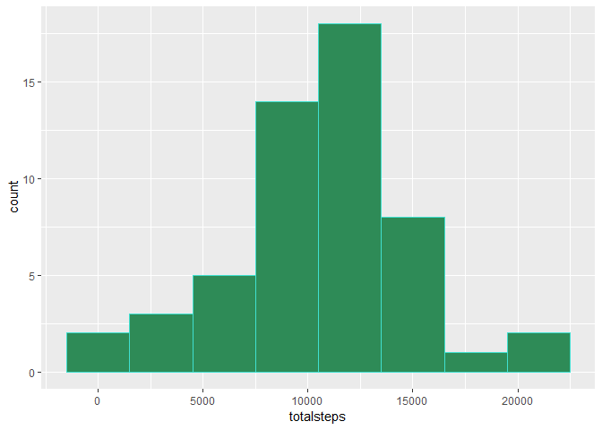
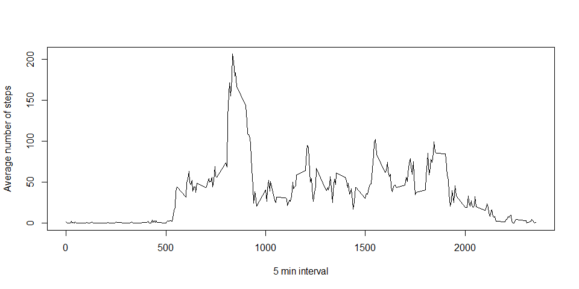
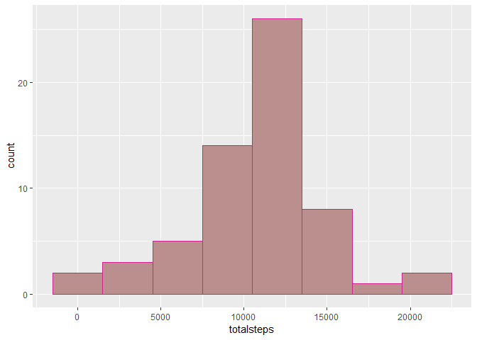
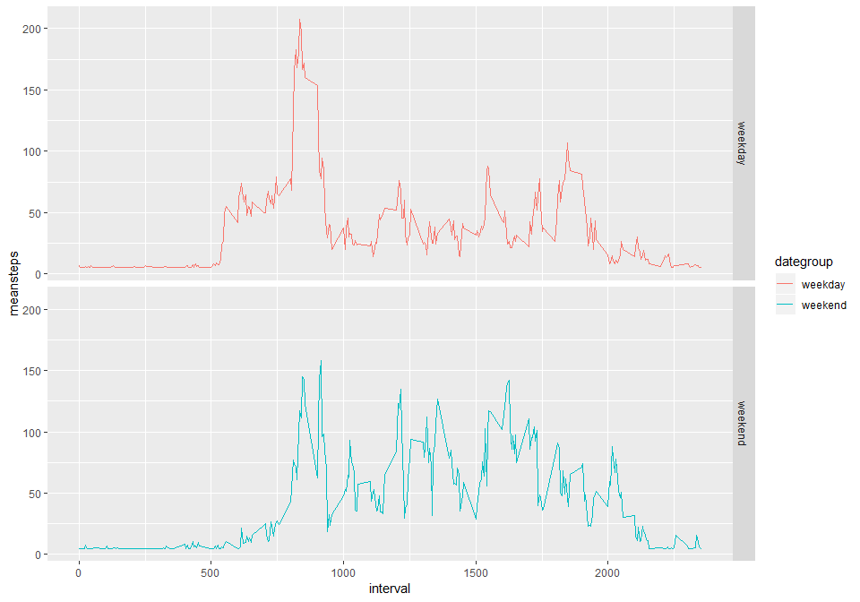

## Loading and preprocessing the data  
### Load libraries for running script

```r
library(dplyr) # for data manipulation
library(ggplot2) # for plots
```

### Loading and preprocessing the data

```r
if (!file.exists("activity.csv")){
        unzip("activity.zip")
        amd <- read.csv("activity.csv")
} else{
        amd <- read.csv("activity.csv")
        }

## Format date variable into "Date" class
amd$date <- as.Date(as.character(amd$date), "%Y-%m-%d")
```


## What is mean total number of steps taken per day?

```r
## amd data without NAs, stored as amd_nona
amd_nona <- amd[!is.na(amd$steps),]

## Total steps per day
steps_perday <- amd_nona %>% group_by(date) %>% summarise(totalsteps = sum(steps))
## Histogram for steps
ggplot(data = steps_perday, aes(totalsteps)) + geom_histogram(fill = "seagreen", binwidth = 3000, color = "turquoise")
```

<!-- -->

```r
## Mean for total number of steps per day
smean <- mean(steps_perday$totalsteps)
paste(c("Mean for total number of steps per day is:"), smean)
```

```
## [1] "Mean for total number of steps per day is: 10766.1886792453"
```

```r
## Median for total number of steps per days
smed <- median(steps_perday$totalsteps)
paste("Median for total number of steps per day is:", smed )
```

```
## [1] "Median for total number of steps per day is: 10765"
```


## What is the average daily activity pattern?

```
## [1] 10766.19
```
*Median for total number of steps per day is: * 

```
## [1] 10765
```

###What is the average daily activity pattern?

```r
av_perday <- amd_nona %>% group_by(interval) %>% summarise(meansteps = mean(steps))
## Plotting the graph
with(av_perday, plot(x = interval, y = meansteps, type = "l", xlab = "5 min interval", ylab = "Average number of steps"))
```

<!-- -->


##Imputing missing values

```r
miss_value <- sum(is.na(amd$steps))
paste("Number of missing values are:", miss_value)
```

```
## [1] "Number of missing values are: 2304"
```

```r
## Filling in missing values
## Get the mean steps
steps_mean <- mean(amd$steps, na.rm = TRUE)
## Fill the missing values with mean
amdna <- amd %>% mutate(steps = ifelse(is.na(steps), steps_mean, steps))

## Histogram of total number of steps each day
steps_fperday <- amdna %>% group_by(date) %>% summarise(totalsteps = sum(steps))
## Histogram for steps
ggplot(data = steps_fperday, aes(totalsteps)) + geom_histogram(fill = "rosybrown", binwidth = 3000, color = "violetred")
```

<!-- -->

```r
## Mean steps per day with NAs(missing values) filled
smean_fna <- mean(steps_fperday$totalsteps)
paste(c("Mean for total number of steps per day with replaced NAs is:"), smean_fna)
```

```
## [1] "Mean for total number of steps per day with replaced NAs is: 10766.1886792453"
```

```r
## Median for total number of steps per day with NAs(missing values) filled
smed_fna <- median(steps_fperday$totalsteps)
paste("Median for total number of steps per day with replaced NAs is:", smed_fna)
```

```
## [1] "Median for total number of steps per day with replaced NAs is: 10766.1886792453"
```
*Filling in missing values with mean of total steps per day has no effect on the mean of total number of steps per day.*  
*Filling in missing values with mean of total steps per day has a small effect on the median of the total number of steps.*  


## Are there differences in activity patterns between weekdays and weekends?

```r
## Create vector containing weekdays
amdna_weekdays <- c("Monday", "Tuesday", "Wednesday", "Thursday", "Friday")
## Create date variable group
amdna$dategroup <- factor(weekdays(amdna$date) %in% amdna_weekdays, levels = c(TRUE, FALSE), labels = c("weekday", "weekend"))
## Group data by interval and date group 
amdna_grp <- amdna %>% group_by(interval, dategroup) %>% summarise(meansteps = mean(steps))
## Plot the graph
ggplot(data = amdna_grp, aes(x =interval, y = meansteps)) + geom_line(aes(color = dategroup)) + facet_grid(rows = vars(dategroup))
```

<!-- -->

*There are more number of steps on weekends than weekdays*
